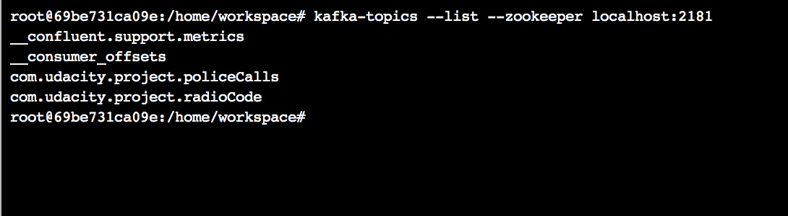
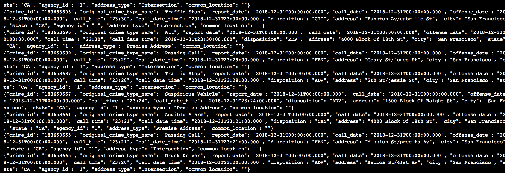
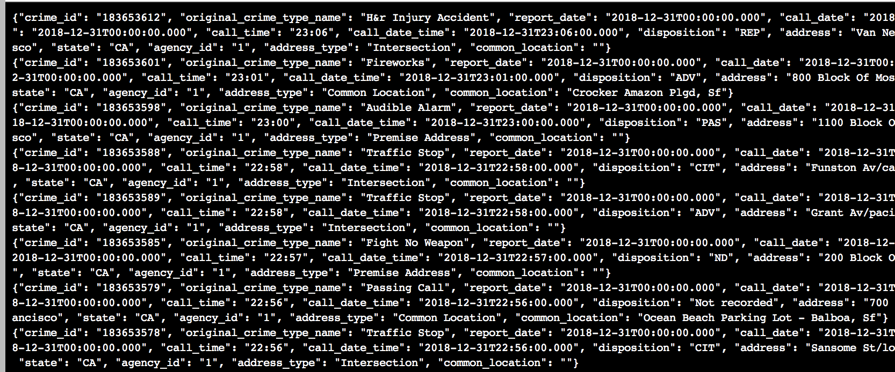
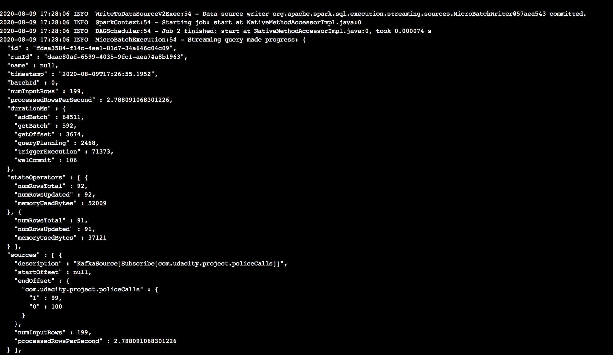
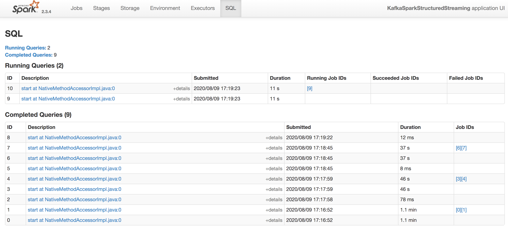

# SF Crime Statistics with Spark Streaming

This project was carried out in the Udacity project workspace.

The zookeeper and kafka servers are started by navigating into the config folder and running the following commands, each in it's own terminal:

`zookeeper-server-start zookeeper.properties`

`kafka-server-start producer.properties`

Next, the requirements are installed by running the following command:

`bash start.sh`

The Todo items in kafka_server.py and the producer_server.py were completed.

The producere was started using the following command:

`python kafka_server.py`

The following command was executed using the kafka CLI, to check that the topic has been created successfully:

`kafka-topics --list --zookeeper localhost:2181`

From the terminal output one can see that the com.udacity.project.policeCalls Topic that is speficied in the kafka_server.py was created successfully:



Next, the kafka consumer CLI was used to make sure that the data is available at that topic. The following command was used:

`kafka-console-consumer --topic "com.udacity.project.policeCalls" --bootstrap-server PLAINTEXT://localhost:9092 --from-beginning`

the following data output is seen in the terminal, indicating that the data can be consumed from the topic:



Next, a consumer service was created, this new file was named "kafka_consumer.py".


The following command was run to start up this consumer server:

`python kafka_consumer.py`

Upon running this command, the terminal shows the following output:



All the Todo items in data_stream.py were completed next. The following command was executed in the terminal:

`spark-submit --packages org.apache.spark:spark-sql-kafka-0-10_2.11:2.3.4 --master local[*] data_stream.py`

The progress reporter could be seen in the terminal:



The spark streaming UI for this project looked as follows:



#### Question 1:
How did changing values on the SparkSession property parameters affect the throughput and latency of the data?

#### Answer:
Increasing processedRowsPerSecond increases the rate at which Spark processes the data. Increasing spark.executor.memory allows spark to access more memory for carrying out computations.

#### Question 2:
What were the 2-3 most efficient SparkSession property key/value pairs? Through testing multiple variations on values, how can you tell these were the most optimal?

#### Answer:

Adjusting the following properties allows for a great improvement in rows processed per second:
1. maxOffsetPerTrigger
2. maxRatePerPartition


```python

```
